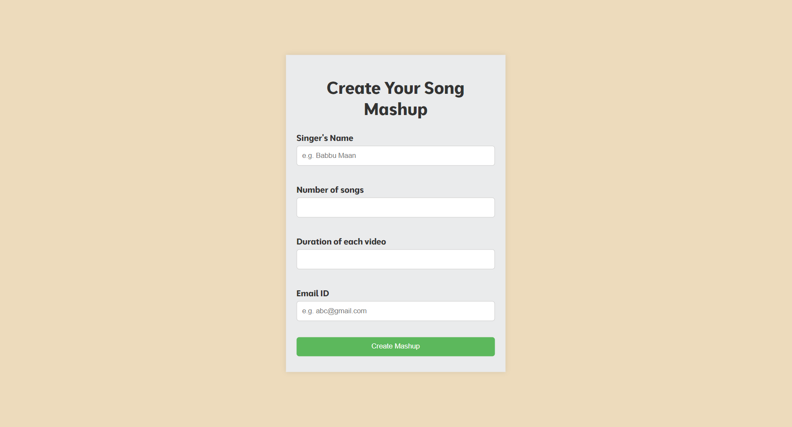

# Song-Mashup
This project helps the user to download a song mashup of their favourite artist's songs. The user has the choice to either run this program through command line or through a web app. <br>

<br>
To run using command line,
```
python 102203714.py <"Singer-name"> <number-of-videos> <audio-duration> <"output-file-name">
```
To run using web app,
```
python app.py
```
Then enter the details as per your likings and you will receive your mashup file!

## Technologies/Frameworks

- Python
- HTML, CSS, JavaScript
- Flask
- MoviePy
- YouTube API (yt_dlp)
- yagmail
